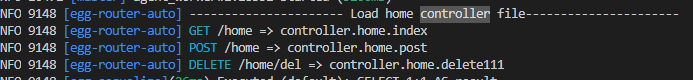

# egg-router-auto

> 根据 controller 文件注释自动生成路由

[![NPM version][npm-image]][npm-url]
[![build status][travis-image]][travis-url]
[![Test coverage][codecov-image]][codecov-url]
[![David deps][david-image]][david-url]
[![Known Vulnerabilities][snyk-image]][snyk-url]
[![npm download][download-image]][download-url]

[npm-image]: https://img.shields.io/npm/v/egg-router-auto.svg?style=flat-square
[npm-url]: https://npmjs.org/package/egg-router-auto
[travis-image]: https://img.shields.io/travis/eggjs/egg-router-auto.svg?style=flat-square
[travis-url]: https://travis-ci.org/eggjs/egg-router-auto
[codecov-image]: https://img.shields.io/codecov/c/github/eggjs/egg-router-auto.svg?style=flat-square
[codecov-url]: https://codecov.io/github/eggjs/egg-router-auto?branch=master
[david-image]: https://img.shields.io/david/eggjs/egg-router-auto.svg?style=flat-square
[david-url]: https://david-dm.org/eggjs/egg-router-auto
[snyk-image]: https://snyk.io/test/npm/egg-router-auto/badge.svg?style=flat-square
[snyk-url]: https://snyk.io/test/npm/egg-router-auto
[download-image]: https://img.shields.io/npm/dm/egg-router-auto.svg?style=flat-square
[download-url]: https://npmjs.org/package/egg-router-auto

<!--
Description here.
-->

## 开启插件

```js
// config/plugin.js
module.exports = {
  // ...
  routerAuto: {
    enable: true,
    package: 'egg-router-auto',
  },
  // ...
}
```

## 详细配置

```js
// config/plugin.js

module.exports = (appInfo) => {
  const config = (exports = {})

  // 路由生成基本路径
  //  ''   => /home
  // 'api' => /api/home
  // 'test' => /test/home
  config.routerAuto = {
    baseApi: 'api',
  }
}
```

## 使用

- 使用 @controller 设置 路由名称

```
@controller home
```

- 使用 @param 设置 请求类型 执行的方法 路由参数

```
// 生成get请求到当前文件 index 方法
@param {get} index

// 生成 get 请求  /home/text
@param {get} index  text

// 生成带参数
@param {delete} delete111 del/:id
```

```
// 只解析每个文件第一个 多行注释 /**  */
// app/controller/home.js
const Controller = require('egg').Controller;
/**
 * 首页
 * @controller home
 * @param {get} index :id
 * @param {post} post
 * @param {delete} delete111 del/:id
 */
class HomeController extends Controller {

   async index() {
    const { ctx } = this
    ctx.body = `hi,  ${ctx.params.id}`
  }

  async post() {
    const { ctx } = this
    ctx.body = 'hi, home post'
  }

  async delete111() {
    const { ctx } = this
    ctx.body = `delete, home  ${ctx.params.id}`
  }

}
module.exports = HomeController;

```

```
// app/router.js
module.exports = (app) => {
  const { router, controller } = app;
  // 没有写注释可以继续在这里配置
  // router.get('/user/:id', controller.user.info);
}

```

### 生成控制台输出



## 提问交流

请到 [egg issues](https://github.com/XXllXX/egg-router-auto/issues) 异步交流。

## License

[MIT](LICENSE)
